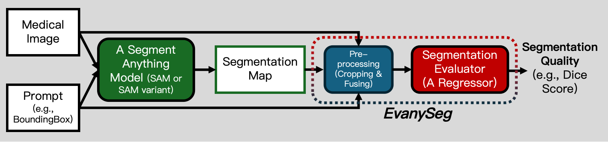

<p align="center">
    <h1 align="center"><a href="https://arxiv.org/pdf/2409.14874" target="_blank">Towards Ground-truth-free Evaluation of Any Segmentation in Medical Images*</a></h1>
</p>


<h4 align="center">
    <p>
        <a href="https://github.com/ahjolsenbics/EvanySeg/blob/main/README.md#Framework">Framework</a> |
        <a href="#-Citing Us">Citing Us</a> |
        <a href="#-Dataset">Dataset</a> |
        <a href="#-Getting Started">Getting Started</a> |
        <a href="#-Demo">Demo</a> |
        <a href="https://github.com/ahjolsenbics/EvanySeg">Page Main</a>
    <p>
</h4>


<p align="center">
    <a href="https://github.com/facebookresearch/segment-anything">
        
    </a>
    <a href="https://drive.google.com/drive/folders/1Ngme9APByRTAOOsLGtwzVYzS2Il4jc1n?usp=drive_link">
        
    </a>
    <a href="https://www.python.org/">
        
    </a>
    <a href="https://github.com/facebookresearch/segment-anything/blob/main/LICENSE">
        
    </a>
</p>

## Framework

EvanySeg is a companion model to SAM and its variants, designed to enhance reliability and trustworthiness in the deployment of SAM (and its variants) on medical images.  

  

## Citing Us
If you're interested in learning more about EvanySeg, we would appreciate your references to [our paper](https://arxiv.org/pdf/2409.14874).

## Dataset
The EvanySeg model was trained based on 2D images, accompanied by object-level ground truth masks. Segmentation predictions for training the EvanySeg model were generated using SAM, MedSAM, and SAM-Med2D.    

The filesystem hierarchy of the dataset is as follows:

```
📁 EvanySeg
├── 📁 checkpoints
├── 📁 result
├── 📁 datasets
│   ├── 📁 preprocess
│   │   └── 📁 train_sam_Polyp
│   │       ├── 📁 crop_image
│   │       │       0_SAM_Polyp_train_175.png
│   │       ├── 📁 crop_mask
│   │       │       0_SAM_Polyp_train_175.png
│   │       └── 📁 crop_predict
│   │       │       0_SAM_Polyp_train_175.png
│   └── 📁 raw          
│       └── 📁 Polyp
│           └── 📁 train
│               ├── 📁 images
│               │       175.png
│               └── 📁 masks
│                       175.png

```
 The processed data naming rules are as follows:
```
├─crop_images
       {i}_{model_name}_{directory}_{part}_{sample_name}
```

Note: "i" represents the index of the connected domain being processed in the current iteration, "model_name" indicates the model SAM and its variants, "directory" represents the directory name of the dataset such as Polyp, "part" indicates the subdirectory, sample_name, "sample_name" indicates the original name of the image


## Getting Started
Download the datasets and pre-trained models to the corresponding folders, and configure the environment.If you plan to train your own dataset,please preprocess it first using the preprocessing.py file.
#### Download
Please download the EvanySeg result checkpoints to the result directory from [ResNet101 result](https://drive.google.com/file/d/1Hj7LwH8zIJUaiQmDOkHM6JUgxkoTyGpu/view?usp=drive_link) and  [Vit-b result](https://drive.google.com/file/d/1S_s8zUgv8V2F8LP_h_4HM96j1LWHzjBB/view?usp=drive_link).

The example datasets are  provided [train.zip](https://drive.google.com/file/d/1gkh0gqIf_oeLUuKo2zYbecAb1vcZdLcH/view?usp=drive_link) and [test.zip](https://drive.google.com/file/d/1oxuHYhFLc0x2Yx7x9Lh73XljPK8ixnr_/view?usp=drive_link)


#### Installation

```python
pip install torch torchvision torchaudio --index-url https://download.pytorch.org/whl/cu124
pip install -r requirements.txt
```

#### Test

```python
python test.py
```

#### Train

```python
python train.py
```

## Demo
Online demo: coming soon.
